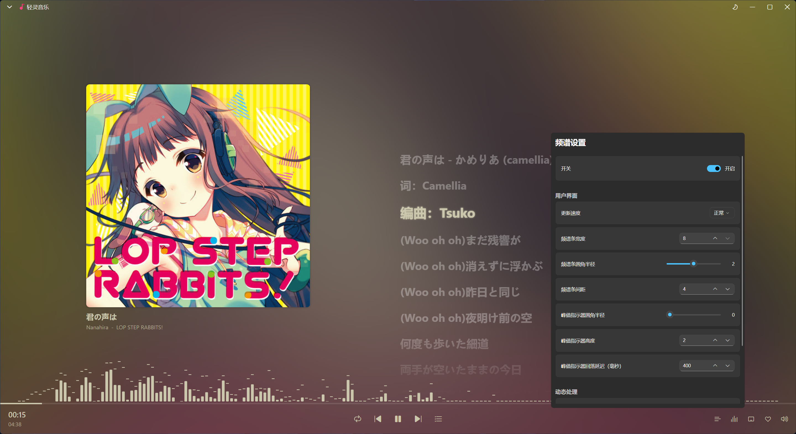
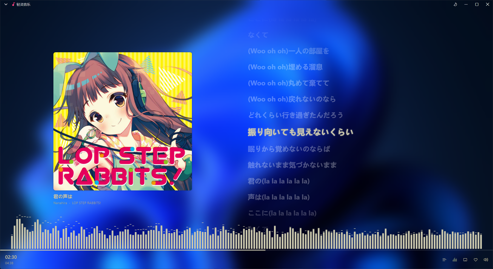
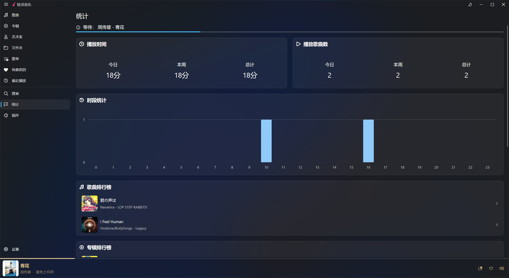

# Ling Player
[简体中文](README.md) | [English](README.en.md)
---
## Description

Ling Player is a local music player supporting FLAC, APE, DSD, MP3, AAC, and other common audio formats. It features CUE sheet parsing, grouped shuffle playback, real-time visualizer, and customizable transparent UI with background images for a personalized experience.

## Core Features

- Support for FLAC/APE/DSD/MP3/AAC and dozens of other audio formats
- Intelligent CUE sheet parsing
- Real-time visualizer effects
- Transparent glass effect + custom background images
- Grouped shuffle playback
- Steam Rich Presence

## Tags

🎵 Rich Format Support · 🎨 Visualizer · ✨ Transparent Effects · 💻 Cross-Platform

## Screenshots

## Download

- [Steam](https://store.steampowered.com/app/4496780/)
- [Microsoft Store](https://www.microsoft.com/store/apps/9PGF663WTBPZ?ocid=badge)

## Links

- 🛡️ [Privacy Policy](https://www.lfengs.com/en-us/apps/ling/privacy-policy.html)
- 🚀 [Changelog](https://www.lfengs.com/en-us/apps/ling/changelog.html)
